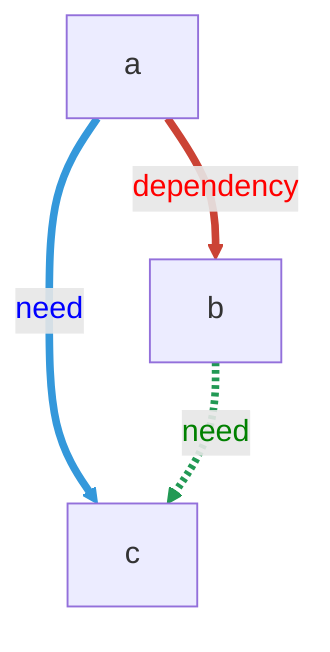

# yaml-to-graphic-py - what it does
simple parser to create a mermaid flow diagram from gitlab yaml files
- it shows relationships between jobs and stages
- it shows needs and dependencies
  - optional needs are dotted connections
  - artifact needs are thick links
  - it aggregates matching needs from different rules scenarios and displays the properties of the first need in a match
- it can show you where your yaml is possibly overcomplex or containing redundant stages  

## How to use it
You don't ned to know yaml pipelines to produce these graphics.  
That said, they are helpful in reviewing yaml, so a pipeline developer/documenter can benefit from them.  
  
We are using mermaid syntax to produce the graphics - :link: [mermaid intro](https://mermaid.js.org/intro/) is a good place to start understanding how that works  

### Make sure your governing stages are included

given this is a flow from a pipeline, the stages must be included.  
If you have broken down your main pipeline to manage it better :thumbsup: yay! you may have to cut and paste for yaml files that are included from higher files like .gitlabci.yml files.  
There isnt currently a effort justifies the means plan to incorporate parsing includes for local files copied over.  

### Constructing a 'bigger picture'
yml files are easier to maintain when the workflows are broken down into logical chunks.  
You may want to see the big picture of the chunks re-united...  
If you try creating the smaller chunks, and add them to the topmost mermaid document, using a left to right or to to bottom subgraph pattern, AND Name and link the subgraphs, that could work.   
**BUT:**  
- keeping a graphic simple really matters,
  - you could end up with a monster that you can't read even with max zoom!
  - these graphics really help with comprehension, bloating them will have the opposite effect
  - You can argue yaml that produces clear and simple graphics is likely to be well written yaml. You will lose that *elegance*
- if you have line styling (see below) that will break because it works by numbers (line 1 has this styling, lines 2,3 have that styling, etc).

command line execution:
```
/usr/local/bin/python3 /pathToPy/mermaid_entry.py $filename
```

export to image command:
```
mmdc -i mdfilename.md -o mdfilename.svg
```

### Some styling

Adding colour to links:
eg
```
linkStyle nth_line, vth_line, yth_line stroke: #cb4335,stroke-width:4px,color:red;
linkStyle mth_line, wth_line, zth_line stroke: #3498db,stroke-width:4px,color:blue;
linkStyle ath_line, bth_line, cth_line stroke:  #229954,stroke-width:4px,color:green;

```

putting it all together this:
````
  ```mermaid
  flowchart TB
  a -- dependency --> b
  a -- need --> c
  b -. need .-> c

  linkStyle 0 stroke: #cb4335,stroke-width:4px,color:red;
  linkStyle 1 stroke: #3498db,stroke-width:4px,color:blue;
  linkStyle 2 stroke:  #229954,stroke-width:4px,color:green;
  ```  
````

produces this:  


